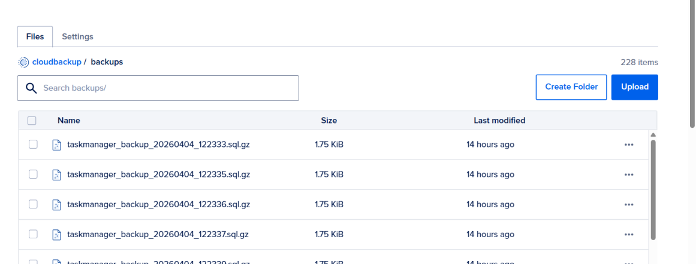
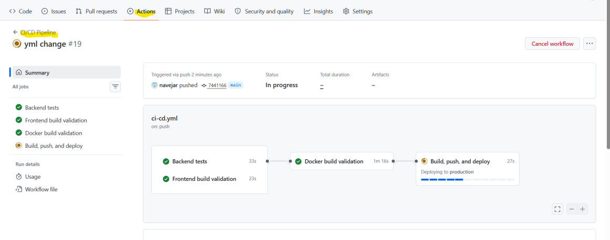
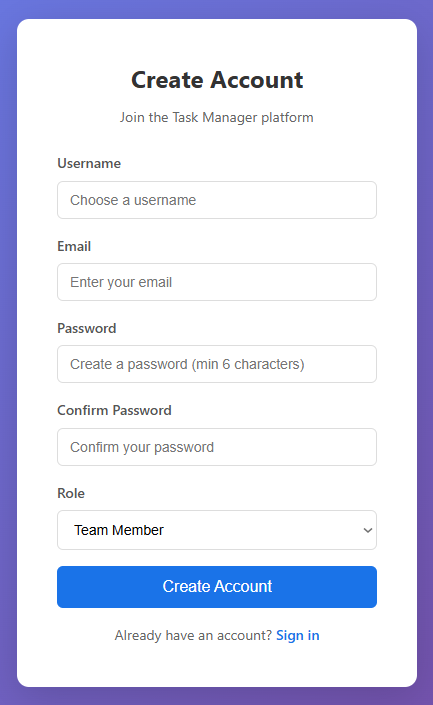
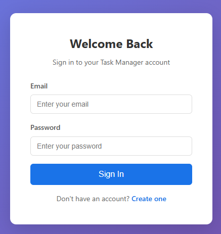
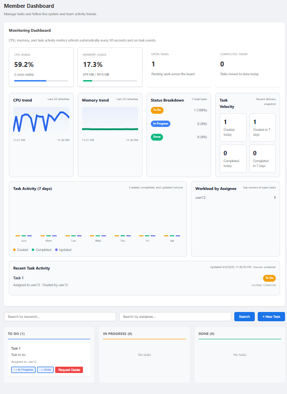
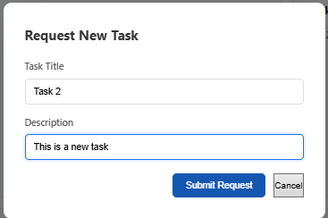
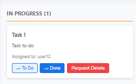
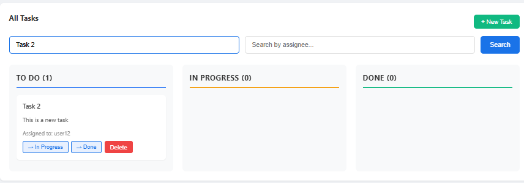
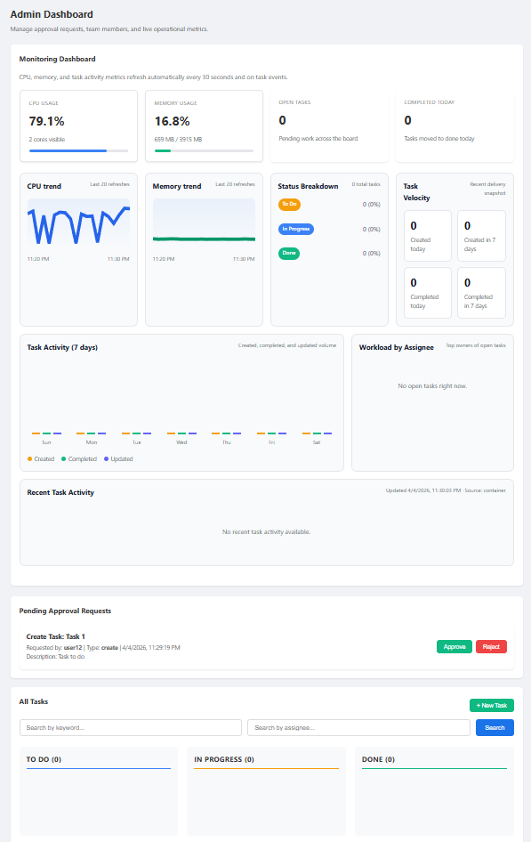

# Collaborative Task Management Platform - Final Report

## Team Information

<table>
  <tr>
    <th>Name</th>
    <th>Student Number</th>
    <th>Email</th>
  </tr>
  <tr>
    <td>Rajevan Logarajah</td>
    <td>1006322533</td>
    <td>rajevan.logarajah@mail.utoronto.ca</td>
  </tr>
  <tr>
    <td>Selim Akef</td>
    <td>1006164124</td>
    <td>selim.akef@mail.utoronto.ca</td>
  </tr>
  <tr>
    <td>Tanish Upreti</td>
    <td>1007727391</td>
    <td>tanish.upreti@mail.utoronto.ca</td>
  </tr>
</table>

## Motivation

This project focuses on building a cloud-native task management system that solves three core problems:

- Lack of real-time synchronization across users  
- Poor access control in collaborative environments  
- Difficulty scaling and maintaining stateful systems 

Existing task managers rely on polling or manual refresh, which leads to inconsistent task states across users. This system eliminates that issue using WebSocket-based real-time updates. Role-based access control ensures that sensitive operations such as task deletion and member management are regulated through administrative approval. From a systems perspective, the project demonstrates a full implementation of a stateful distributed application using containerization, orchestration, persistent storage, monitoring, and CI/CD pipelines. Our target end users are group members and administration leaders of a team.

## Objectives
The project was designed with the following objectives:

- Create a user-friendly application that enables members and administrators to manage project tasks in an IT setting  
- Allow members to seamlessly monitor task status without requiring manual refresh  
- Implement role-based access control where the administrator approves the creation or deletion of tasks  
- Enable team members to send approval requests to the administrator for task-related actions  
- Provide administrative control to remove members from the system  
- Implement real-time task updates using WebSockets without requiring page refresh  
- Enable search functionality for tasks by keyword or assignee  
- Implement a full-stack task management platform with real-time updates  
- Support complete task lifecycle management (create, assign, update, delete with approval)  
- Ensure persistent storage using PostgreSQL and DigitalOcean volumes  
- Deploy the application using Docker Swarm for orchestration  
- Integrate monitoring, automated backups, and CI/CD pipelines

## Technical Stack

The system was implemented as a containerized full-stack application with separate frontend, backend, database, and infrastructure components.

### Frontend

- React 18 for building the user interface  
- React Router DOM for navigation between pages  
- Axios for API communication  
- WebSocket client for receiving real-time task updates  
- Nginx used in production to serve the frontend and route requests  

### Backend

- Node.js with Express for API and application logic  
- REST API for authentication, tasks, and admin actions  
- ws (WebSocket library) for real-time updates  
- bcryptjs for password hashing  
- jsonwebtoken (JWT) for authentication  
- dotenv for environment configuration  

### Database and Persistence

- PostgreSQL for storing users, roles, and tasks  
- Database initialized using SQL scripts  
- Persistent storage handled through Docker volumes and DigitalOcean storage  

### Containerization and Local Development

- Docker to containerize all services  
- Docker Compose for running multi-container environments locally  

### Orchestration

Docker Swarm used for orchestration  
- Service replication for frontend and backend  
- Built-in load balancing  
- Simpler setup compared to Kubernetes  

### Deployment Infrastructure

- DigitalOcean Droplets used to host the application  
- Swarm stack deployed using docker-stack.yml  

### CI/CD Pipeline

- GitHub Actions for automated build and deployment  

### Monitoring and Backups

- DigitalOcean Metrics for CPU and memory monitoring  
- Backend monitoring endpoints for task activity  
- Automated PostgreSQL backups using scheduled jobs  

## Features

The core features utilized are:

### User Authentication and Account Management

Users can register, log in, and log out, ensuring that all actions are tied to specific users and enabling controlled multi-user access.

### Role-Based Access Control

The system defines administrator and member roles to enforce structured workflows.

- Administrators approve or reject task creation and deletion requests  
- Administrators can remove members  
- Members can create tasks and submit approval requests  

### Task Creation, Assignment, and Status Tracking

Users can create tasks, assign them to members, and update their progress, supporting full task lifecycle management.

- Each task includes a title, description, assignee, and status  
- Status values include To-Do, In Progress, and Done  
- Task deletion requires administrator approval  

### Real-Time Task Updates

Task updates are pushed to all connected clients using WebSockets, allowing users to see changes immediately without refreshing.

### Search Functionality

Tasks can be searched using keywords from the title or description, or by assigned user, improving usability as task volume increases.

### Persistent Storage

All data is stored in PostgreSQL and persists across container restarts using external storage, ensuring the system remains stateful.

### Containerization and Orchestration

The application is containerized using Docker and deployed using Docker Swarm with replicated services, meeting the requirement for orchestration in a distributed system.

### Monitoring

CPU usage, memory usage, and task activity are tracked using DigitalOcean metrics and backend endpoints to observe system behavior under load.

### Automated Backups

Automated cloud database backups are created at regular intervals and stored for recovery, reducing risk of data loss.



### CI/CD Pipeline

The application is built and deployed automatically using GitHub Actions when changes are pushed, supporting consistent and repeatable deployment.



## User Guide

This section outlines how to use the main features of the application.

### Accessing the Application

1. Open the application in a browser using the deployed URL  
2. You will be redirected to the login or registration page  

### Creating an Account

1. Navigate to the registration page  
2. Enter a username, email, and password  
3. Submit the form  
4. Log in using your credentials  



### Logging In

1. Enter your email and password  
2. Click login  
3. You will be redirected to the dashboard  



### Dashboard

After logging in, users can view and interact with tasks.

- Members can view assigned tasks and create new ones  
- Admins can view all tasks and approval requests  



### Creating a Task

1. Click "Create Task"  
2. Enter:
   - Title  
   - Description  
   - Assignee  
3. Submit  



### Updating Task Status

1. Select a task  
2. Change status:
   - To-Do  
   - In Progress  
   - Done  

Changes appear immediately.



### Searching Tasks

1. Use the search bar  
2. Enter keyword or assignee  
3. Results update automatically  



Task updates are automatically reflected for all users without refreshing.

### Admin Actions

1. Go to admin panel  
2. Review task requests  
3. Approve or reject  
4. Remove users if needed  



### Logging Out

1. Click logout  
2. You will be redirected to login page  


## Development Guide

The project is developed locally using Docker Compose with separate frontend, backend, database, and backup services. The main configuration files used are `docker-compose.yml`, `docker-compose.dev.yml`, and `backend/.env.example`.

### Prerequisites

- Docker  
- Docker Compose  
- Git  

### Clone the Repository

```bash
git clone https://github.com/navejar/Task-management-platform-project.git
cd Task-management-platform-project
```

### Environment Configuration

Create a `.env` file in the `backend` directory using `backend/.env.example`.

```env
# Database
DB_HOST=db
DB_PORT=5432
DB_NAME=taskmanager
DB_USER=postgres
DB_PASSWORD=your_password_here

# JWT
JWT_SECRET=your_jwt_secret_here
JWT_EXPIRES_IN=24h

# Server
PORT=5001
NODE_ENV=development

# DigitalOcean Metrics
DO_API_TOKEN=your_digitalocean_api_token
DO_DROPLET_ID=your_droplet_id

# Backup (S3-compatible DigitalOcean Spaces)
DO_SPACES_KEY=your_spaces_key
DO_SPACES_SECRET=your_spaces_secret
DO_SPACES_BUCKET=your_bucket_name
DO_SPACES_REGION=nyc3
```

Values should be replaced with valid credentials before running the application.

### Database Setup

PostgreSQL runs as a container using the `postgres:16-alpine` image. The database is initialized automatically using the file:

```
backend/src/config/init.sql
```

### Storage

Persistent storage is handled using Docker volumes:

- `pgdata` mounted to `/var/lib/postgresql/data`  
- `dbbackups` mounted to `/backups`  

### Running the Project Locally

```bash
docker compose up --build -d
```

For development mode:

```bash
docker compose -f docker-compose.yml -f docker-compose.dev.yml up --build
```

### Local Access

- Frontend: `http://localhost` (or `http://localhost:3000` in dev mode)  
- Backend API: `http://localhost:5001`  

### Included Services

- `db` (PostgreSQL)  
- `backend` (Node.js API)  
- `frontend` (React client)  
- `backup` (automated database backups)  

### Local Testing

Run backend tests:

```bash
cd backend
npm install
npm test
```

Manual testing includes:

- registering a user  
- logging in  
- creating and updating tasks  
- verifying real-time updates  
- confirming data persists after restart  

### Stopping the Application

```bash
docker compose down
```

```bash
docker compose -f docker-compose.yml -f docker-compose.dev.yml down
```

## Deployment Information

The application is deployed on DigitalOcean using Docker Swarm for orchestration.

Live URL: http://167.99.177.118/

## AI Assistance & Verification

AI tools were used in a limited and targeted manner to support implementation details rather than drive the overall system design. Core decisions such as using Docker Swarm, PostgreSQL for persistence, and the overall architecture were determined by the team prior to using AI. AI was primarily used to clarify specific technical problems, including WebSocket authentication using JWT, handling session persistence during backend downtime, and evaluating different approaches for implementing search in PostgreSQL.

One representative limitation occurred during the WebSocket implementation. While AI suggested passing the JWT through query parameters and validating it on connection, it did not account for certain implementation details such as proper URL parsing or handling different failure scenarios. This led to runtime issues that required manual debugging and adjustments. Additional limitations were observed in the PostgreSQL search suggestion, where full-text search using `to_tsquery` was recommended without accounting for the need to preprocess user input, resulting in query errors when handling raw input.

All AI-assisted outputs were critically evaluated before use. Correctness was verified through a combination of manual testing and system-level validation. This included testing API endpoints with different input cases, verifying WebSocket behavior with valid and invalid tokens, inspecting Docker logs to confirm service behavior, and testing system behavior during backend downtime. Data persistence was also verified by restarting containers and confirming that application state remained intact. Further details and specific examples of AI interactions are documented in `ai-session.md`.

## Individual Contributions

Work was divided across frontend, backend, infrastructure, and database components, with responsibilities aligned to the original project plan.

### Selim

- Implemented login and account creation functionality  
- Designed the admin dashboard for handling task approval requests  
- Implemented functionality to update task progress (To-Do, In Progress, Done)  
- Added functionality for removing members  
- Implemented PostgreSQL schema and database initialization
- Implemented logout functionality  

### Tanish

- Designed and implemented the task creation interface  
- Implemented approval request logic for task actions  
- Added functionality for deleting tasks    
- Developed search functionality for tasks by keyword and assignee  
- Created the project README and documentation  

### Rajevan

- Configured Dockerfiles and container setup  
- Set up DigitalOcean volumes for persistent storage  
- Implemented automated database backups to cloud storage  
- Integrated DigitalOcean metrics to track CPU and memory usage  
- Set up CI/CD pipeline using GitHub Actions for automated deployment  

Each team member contributed to testing, debugging, and integration across components to ensure the system functioned correctly in both local and deployed environments.

## Lessons Learned and Concluding Remarks

This project provided practical experience in building and deploying a full-stack cloud application. Understanding how different components work in a containerized environment, especially when moving from local development (with Docker Compose) to deployment using Docker Swarm. Setting up orchestration brought up challenges related to service communication, networking, and maintaining consistent behavior across replicated containers.

Working with WebSockets produced additional complexity compared to standard REST API. Particularly in ensuring that real-time updates remained consistent when multiple clients were connected. Debugging these issues required frequent testing as well as a better understanding of how state and events propagate in the system.

Another important takeaway was the persistent storage. Ensuring that PostgreSQL data remained intact across container restarts required proper configuration of volumes. This reinforced the importance of state management in cloud-based applications. Implementing automated backups illustrated the need for reliability and recovery planning in real-world systems.

The CI/CD pipeline also demonstrated how development workflows can be streamlined. Automating builds and deployments reduced manual effort but required precise configuration in order to avoid failures during deployment.

The project brought together multiple concepts from the course such as containerization, orchestration, stateful design, and cloud deployment. It provided a clear view of how these components work together in practice and highlighted the trade-offs between simplicity and scalability when choosing tools such as Docker Swarm.

## Video Demo

The demo video showcasing the system functionality can be accessed here:

[Watch Video Demo](https://www.youtube.com/watch?v=rQsRGsmQevs)